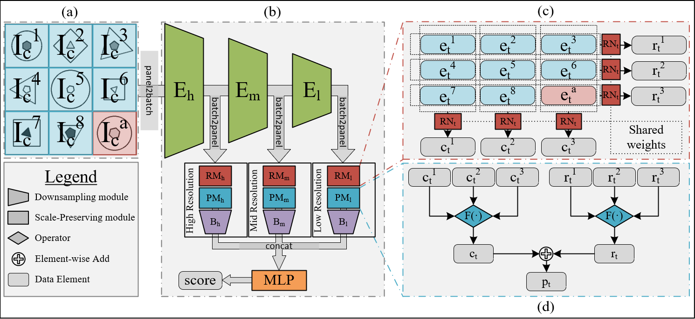

# MRNet - Multi-scale Reasoning Network
Code for "Scale-Localized Abstract Reasoning" [paper](https://github.com/yanivbenny/MRNet).

## Requirements
* python 3.6
* NVIDIA GPU with CUDA 10.0+ capability
* numpy, scipy, matplotlib
* torch==1.4.0
* torchvision==0.5.0
* scikit-image

## Data
* [PGM](https://github.com/deepmind/abstract-reasoning-matrices)
* [RAVEN](https://github.com/WellyZhang/RAVEN)
* [RAVEN-FAIR](https://github.com/yanivbenny/RAVEN_FAIR) (Balanced version of RAVEN)

## Code
Code and models will be uploaded soon.

## Pretrained models
Download the pretrained models for PGM and RAVEN-FAIR:
https://drive.google.com/drive/folders/1ss1ZSSZ3SOH7O8vrqUw4jeAkxYuiYmTx?usp=sharing
